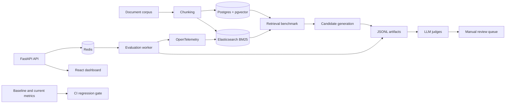

# LLM Agent Evaluation and Reliability Platform

[](https://github.com/XiaoyunYin/LLM-Agent-Evaluation-Reliability-Platform/actions/workflows/eval-regression-gate.yml)

This repository is an evaluation harness for tool-using LLM agents. It focuses on
checks that can be run against an external result: SQL execution, database state
changes, and side-effect records. LLM judges are included for RAG experiments, but
they are not used as the source of truth for the agent benchmarks.

Runs are written to disk with their configuration and intermediate records. The
published metrics are recomputed from those artifacts by audit scripts, and null
or inconclusive results remain in the reports.

## Current results

| Area | Result | Report |
|---|---|---|
| Spider SQL agent (P0) | 65.38% test-suite and 73.31% single-database execution accuracy on all 1,034 Spider dev tasks | [P0 results](docs/results/spider-p0.md) |
| Run-to-run variance (P1) | 1.35 percentage-point maximum spread across four same-commit repeats; CI failure threshold set at 2.71 points | [P1 results](docs/results/p1-frozen.md) |
| Targeted SQL-agent change (P2) | Frozen-cohort completion increased from 19.23% to 71.79% | [P2 results](docs/results/p2-frozen.md) |
| Stateful support agent (P3) | 90.25% mean success over 10 repeats and 800 episodes | [P3 results](docs/results/p3-frozen.md) |
| Crash recovery (P4a) | 915/915 deterministic cases passed, including 835 injected crashes | [P4a results](docs/results/p4a-matrix.md) |
| RAG run matrix | 79 completed runs and 9,480 generated and judged answers | [Claims ledger](docs/claims.md#2-scale--runs-candidate-answers-judged-answers) |
| Dual-judge validation | 65.0% pass/fail agreement, Cohen's kappa 0.264, and 52/120 cases routed for review | [Claims ledger](docs/claims.md#3-judge-validation--dual-judge-agreement-and-manual-review-routing) |

These numbers describe different workloads and should not be combined into one
quality score. In particular, the Spider result is not comparable to the public
Spider leaderboard because this agent must discover the schema through tools. The
[benchmark protocol](docs/benchmark-protocol.md) explains the difference.

## How the evaluations work

### SQL agent: P0 through P2

The SQL agent receives a Spider question and an isolated, read-only SQLite
database. It does not receive the schema in its prompt. It can call three tools:

- `inspect_schema`
- `execute_sql`
- `submit_answer`

The submitted query is scored with the vendored Spider evaluator. The stricter
test-suite metric executes it against multiple compatible database instances; the
single-database metric uses the database shipped with the task. Model turns, tool
calls, submitted SQL, verification results, and traces are persisted for each
episode.

P1 repeats the same configuration to estimate normal run-to-run movement. P2 uses
a cohort frozen from the P1 failures to test one pre-registered change: reminding
the model to submit a query that it has already executed successfully.

Key files:

- [Frozen P0 configuration](docs/P0_BASELINE.md)
- [P1 pre-registration](docs/P1_PREREGISTRATION_V2.md)
- [P2 pre-registration](docs/P2_PREREGISTRATION.md)
- [`scripts/run_spider_benchmark.py`](scripts/run_spider_benchmark.py)
- [`scripts/audit_p0_claims.py`](scripts/audit_p0_claims.py)

### Stateful agent: P3

P3 contains 80 support-ticket tasks. The agent searches and updates a live SQLite
database through typed tools. Each task declares required, allowed, and forbidden
changes. The verifier compares the normalized database state before and after the
episode:

```text
required ⊆ actual ⊆ required ∪ allowed
actual ∩ forbidden = ∅
```

An otherwise correct action fails if it includes an undeclared mutation. Comment
checks use structured fields rather than an LLM judge. The verifier suite includes
known-good references and adversarial known-bad cases.

The frozen suite has 35 core tasks and 45 harder tasks. Seven of its eleven
families reached 100% for the tested model, so the report treats those families as
saturated. A pre-registered schema-repair intervention produced no measurable
effect because neither arm contained a repeated invalid call.

Key files:

- [Suite composition](docs/P3_SUITE_COMPOSITION.md)
- [Frozen contract](docs/P3_CONTRACT_V0.md)
- [Calibration history](docs/P3_CALIBRATION_CHANGELOG.md)
- [Final results](docs/results/p3-frozen.md)

### Crash recovery: P4a

P4a replays the P3 reference trajectories without model calls. Before a mutating
tool call, the runner stores a write-ahead intent with a stable call identity. The
effect store commits the business mutation and idempotency record atomically. A
new worker resumes unfinished work after the lease expires.

The deterministic matrix injects a crash at five positions around each of 167
mutating steps, then runs 80 clean controls. All 915 cases completed with no lost
or duplicate effects and no incorrect final state.

This result is limited to the Python, single-host test harness. The matrix does not
test a paused stale worker, OS-level process suspension, or the planned Java
integration. See the [P4a audit](docs/results/p4a-audit.md) for the exact boundary.

### RAG and judge validation

The earlier RAG work covers dense retrieval with pgvector, BM25 with
Elasticsearch, reciprocal-rank fusion, candidate generation, and LLM judging.
Retrieval was evaluated on the synthetic support corpus and on BEIR SciFact and
NFCorpus.

The main retrieval result is conditional rather than universal:

| Corpus | Strongest single retriever | Hybrid relative to the strongest single retriever |
|---|---|---|
| Synthetic support corpus | BM25 | Lower |
| BEIR SciFact | Dense | +2.8% recall@10 and +3.1% nDCG@10 |
| BEIR NFCorpus | Dense | Effectively tied |

RRF parameters were selected on each dataset's training split and evaluated on
its held-out test split. Candidate depth mattered more than the RRF `k` value, but
the preferred depth did not transfer between SciFact and NFCorpus.

The first dual-judge fixture was invalid: its questions did not match the corpus,
and both judges failed every answer. That result is retained as a superseded
artifact. The replacement run used human-written SQuAD questions and answers. On
that 120-answer slice, `gpt-4.1-mini` and the self-hosted Mistral-7B judge agreed on
65.0% of pass/fail decisions. The small model failed 56 answers while the larger
model failed 16, so disagreements are sent to a review queue instead of treating
either judge as an oracle.

## Architecture



## Repository layout

| Path | Contents |
|---|---|
| `backend/` | FastAPI API, agents, tool runtimes, verifiers, tracing, and durability code |
| `frontend/` | React and TypeScript dashboard |
| `config/` | Frozen manifests and experiment configuration |
| `datasets/` | Benchmark inputs, generated corpus, and label files |
| `docs/` | Protocols, pre-registrations, runbooks, and result reports |
| `metrics/` | CI gate fixtures |
| `prompts/` | Versioned prompt and judge-rubric text |
| `runs/` | Persisted run artifacts used by the reports |
| `scripts/` | Data preparation, runners, audits, and reporting commands |
| `tests/` | Unit and integration tests |

## Run locally

Prerequisites:

- Python 3.12
- Docker Desktop
- Node.js and npm
- Provider API keys in `.env` only for paid model runs

Create the Python environment:

```powershell
python -m venv .venv
.\.venv\Scripts\python.exe -m pip install -r requirements.txt
```

Start the local services and verify connectivity:

```powershell
docker compose up -d postgres elasticsearch redis otel-collector
.\.venv\Scripts\python.exe scripts\check_postgres_connection.py
.\.venv\Scripts\python.exe scripts\check_elasticsearch_connection.py
.\.venv\Scripts\python.exe scripts\check_redis_connection.py
```

Start the API:

```powershell
.\.venv\Scripts\python.exe -m uvicorn backend.main:app --reload
```

In another terminal, start the dashboard:

```powershell
cd frontend
npm install
npm run dev
```

See [frontend/README.md](frontend/README.md) for the dashboard's data sources and
write path.

Run the test suite:

```powershell
.\.venv\Scripts\python.exe -m pytest
```

### Reproduce the Spider baseline

Paid runs require the configured provider key. The mock command checks the runner
without making provider requests.

```powershell
python scripts/download_spider.py
python scripts/qa_spider_evaluator.py --split dev
python scripts/run_spider_benchmark.py --mock --limit 5
python scripts/run_spider_benchmark.py --stage full
python scripts/report_spider_metrics.py --run-id <run_id> --check-traces
python scripts/audit_p0_claims.py --run-id <run_id>
```

## Dashboard

| View | Screenshot |
|---|---|
| Agent evaluation |  |
| Stateful benchmark |  |
| Crash recovery |  |
| Regression gate |  |
| Retrieval |  |
| Judge comparison |  |

The screenshot script captures the full dashboard routes:

```bash
bash scripts/capture_screenshots.sh
```

The `agent*.png` files are manually cropped from the `/agents` page; the underlying
page is also captured as `agents.png`.

## Evidence and reproducibility

The repository separates four kinds of record:

- **Protocols and pre-registrations** define inputs, metrics, exclusions, and
  decision rules before a run.
- **Run artifacts** contain raw episodes, trajectories, scores, status, and
  configuration.
- **Result reports** summarize a frozen run or family of runs.
- **Audit scripts** recompute public numbers and fail when an artifact and report
  disagree.

The [claims ledger](docs/claims.md) maps each public claim to its source and scope.
The [defect ledger](docs/DEFECT_LEDGER.md) records evaluation defects that produced
plausible but incorrect measurements or made tasks unsolvable.

## Known limits

- The Spider agent must discover schema through tools, so its accuracy is an
  internal baseline rather than a leaderboard result.
- The P3 benchmark is small and partly saturated for the tested model.
- P4a is a deterministic single-host harness. P4b integration and stale-worker
  fencing tests are not implemented.
- Dual-judge agreement measures consistency between two judges, not agreement
  with a human-labeled correctness standard.
- The 79 RAG runs contain repeated configurations at temperature 0.7. They are
  useful for stability checks but are not 79 independent experiments.

## Documentation index

- [Benchmark protocol](docs/benchmark-protocol.md)
- [Claims and evidence](docs/claims.md)
- [Locked Spider inputs](docs/LOCKED_INPUTS.md)
- [P0 results](docs/results/spider-p0.md)
- [P1 results](docs/results/p1-frozen.md)
- [P2 results](docs/results/p2-frozen.md)
- [P3 results](docs/results/p3-frozen.md)
- [P4a results](docs/results/p4a-matrix.md)
- [GPU runbook](docs/runbooks/gpu-window.md)
- [Silent tool failures](docs/SILENT_TOOL_FAILURE.md)
