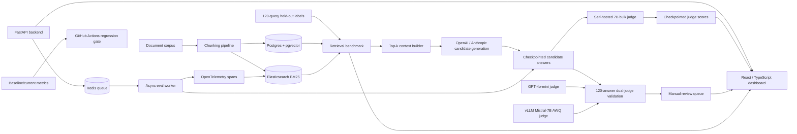

# LLM Evaluation Regression Platform

An end-to-end LLM evaluation and regression-testing platform for measuring RAG candidate answers, validating judge behavior, routing judge disagreements to review, and blocking regressions in CI.

## Recruiter Scan

Recruiters usually look for three things in the first 10 seconds: what the project is, whether the stack matches the role, and whether the numbers are real. This README puts the summary, architecture, features, and measured metrics first so the project reads quickly without overstating unfinished work.

Hiring managers usually inspect the deeper parts: how the dataset was controlled, whether the benchmark avoids leakage, how runs resume after failures, whether judge scores are validated, how tracing ties actions together, and whether the CI gate actually fails on regressions. The sections below are written for that second read.

## Architecture



## Key Features

- RAG evaluation pipeline with corpus chunking, pgvector dense retrieval, Elasticsearch BM25 retrieval, and hybrid RRF configuration.
- Real candidate generation across OpenAI and Anthropic APIs, persisted as checkpoint-resumable JSONL artifacts.
- Judge rubric shared across GPT-4o-mini validation and self-hosted 7B bulk judging.
- Self-hosted judge run on AWS `g4dn.xlarge` with a T4 GPU and vLLM serving `Mistral-7B-Instruct-v0.3-AWQ`.
- Dual-judge validation harness over the same 120-answer slice, with disagreement routing to a manual review queue.
- Async Redis Queue runner for eval jobs, with structured job payloads and resumable candidate generation.
- OpenTelemetry instrumentation across six service layers: gateway, retrieval, provider, judge, tool, and storage.
- React/TypeScript dashboard for metrics, runs, retrieval status, judge validation, and manual review.
- GitHub Actions CI regression gate for eval score, latency, and cost deltas.

## Measured Metrics

Only measured results are listed here. Targets and resume claims stay out of this table until they are backed by artifacts.

| Metric | Measured value | Source |
|---|---:|---|
| Corpus documents | 1,100 | `frontend/src/data/metricsSnapshot.ts`, Session 19 file count |
| Corpus chunks | 9,900 | `frontend/src/data/metricsSnapshot.ts`, Session 19 line count |
| Chunks indexed in Elasticsearch | 9,900 | Elasticsearch `llm_eval_chunks` count, Session 24/45 |
| Held-out labeled retrieval queries | 120 | `scripts/validate_retrieval_labels.py --strict` |
| BM25 recall@10 | 0.0667 | `frontend/src/data/metricsSnapshot.ts`, Session 24 |
| BM25 nDCG@10 | 0.0377 | `frontend/src/data/metricsSnapshot.ts`, Session 24 |
| Production candidate run artifacts | 8 | `docs/results/scale-runs.md` and Session 45 reconciliation |
| Completed production candidate answers | 960 | `docs/results/scale-runs.md` and Session 45 reconciliation |
| OpenAI candidate answers | 480 | Session 45 reconciliation |
| Anthropic candidate answers | 480 | Session 45 reconciliation |
| Self-hosted 7B bulk-judged answers | 960 | `docs/results/scale-runs.md` |
| Bulk judge failures | 0 | `docs/results/scale-runs.md` |
| Dual-judge validation slice | 120 answers | `runs/gpu_window/real_7b_validation_report.json` |
| Pass/fail inter-judge agreement | 100.00% (degenerate, see below) | `runs/gpu_window/real_7b_validation_report.json` |
| Score agreement at threshold 0.25 | 92.50% | `docs/results/scale-runs.md` |
| Manual review routed cases | 9 | `runs/gpu_window/real_7b_manual_review_queue.jsonl` |
| Cohen's kappa | undefined (single-category slice) | `scripts/recompute_validation_report.py` |
| Bulk judge sustained throughput | 23.2 judgments/min | `runs/self_hosted_bulk_judging/*_judge_scores.jsonl` timestamps |
| Bulk judge per-answer latency | p50 2.62s / p95 3.37s | same, at concurrency 1 |
| vLLM sustained output throughput at concurrency 16 | 56.18 tok/s | `docs/results/vllm-benchmark.md` |
| vLLM total token throughput at concurrency 16 | 506.48 tok/s | `runs/vllm_benchmark/mistral_7b_awq_t4_c16_n64.json` |
| vLLM peak output throughput at concurrency 16 | 144.00 tok/s | `docs/results/vllm-benchmark.md` |
| Distinct chunk texts in corpus | 2,262 of 9,900 | `scripts/analyze_corpus_duplication.py` |
| Theoretical max recall@10 on current labels | 0.0846 | `scripts/analyze_corpus_duplication.py` |
| Elasticsearch trace documents | 0 | Session 45 trace count; `otel-traces` index was absent |

Important metric boundaries:

- Candidate-answer count and judged-answer count are different because an answer must be generated before it can be judged. A generated answer may be unjudged, failed, skipped, or judged later.
- The vLLM throughput benchmark is separate from the bulk-judging run. The measured sustained benchmark was 56.18 output tok/s at concurrency 16; 144.00 tok/s was peak benchmark throughput, not sustained bulk-run throughput. The workload was prefill-heavy (2,052 input vs 256 output tokens per request), which is why output tok/s is modest while total token throughput is 506.48 tok/s.
- The 960-answer bulk judging run executed at **concurrency 1**, not 16. Its 23.2 judgments/min is a real sustained end-to-end measurement, but it must not be attributed to the concurrency-16 benchmark.
- The trace count is currently 0 because the trace index was not present when counted. The code has instrumentation and tests, but the persisted Elasticsearch trace volume has not been demonstrated yet.

### Known fixture defect: the retrieval benchmark is not yet meaningful

`scripts/analyze_corpus_duplication.py` measures a defect that invalidates the current
retrieval numbers, and it is documented here rather than hidden:

- The corpus was generated from templates. Only **2,262 of 9,900** chunk texts are
  distinct, and the largest duplicate cluster holds **330 byte-identical chunks**.
- **All 180** labeled relevant chunks sit in clusters of 110-330 identical texts. A
  retriever has no signal to prefer the one chunk ID named in the label file over its
  identical siblings.
- That caps recall@10 at a **theoretical maximum of 0.0846** regardless of retrieval
  quality. The measured BM25 recall@10 of 0.0667 is 79% of that ceiling, so BM25 is
  behaving correctly and the fixture is the limiting factor.
- The 2,200 chunks with cluster size 1 are unique only because the document title
  carries a document number; their body text is the same boilerplate. Relabeling
  therefore cannot repair this. The corpus needs regenerating with genuinely
  document-specific facts before any retrieval quality claim is meaningful.
- Relatedly, every one of the 180 labels is grade 2, so the label set is binary in
  substance and nDCG@10 currently carries no more information than recall@10.

### Known defect: the dual-judge validation slice is degenerate

Both judges marked **all 120** validation cases as failed, and the self-hosted 7B
returned correctness 0.0 on all 120. Pass/fail agreement of 100% is therefore trivially
high, and Cohen's kappa is undefined rather than 1.00 — chance agreement is also 100%
when both raters use a single category.

Root cause: `datasets/golden/golden_rag_v0.1.jsonl` is arithmetic and general-reasoning
QA, while the corpus is synthetic support runbooks. The questions are not answerable
from the corpus, so 115 of 120 candidate answers are correctly-refusing "the context is
insufficient" responses and both judges correctly fail all of them. The judge harness is
working; the evaluation fixture is mismatched. **This slice does not support a
judge-agreement claim.**

## Screenshots

The React dashboard is implemented, but project screenshots are not yet committed. The intended recruiter-facing captures are:

| View | Purpose |
|---|---|
| Overview dashboard | Show measured corpus, run, judge, and infrastructure status at a glance. |
| Retrieval page | Show dense, BM25, and hybrid benchmark status without hiding missing measurements. |
| Runs page | Show eval run metadata and provider coverage. |
| Judges page | Show validation agreement, self-hosted judge metadata, and benchmark boundaries. |
| Review queue | Show disagreement cases routed for human inspection. |

Recommended screenshot folder: `docs/screenshots/`.

## How To Run Locally

Prerequisites:

- Python 3.12
- Docker Desktop
- Node.js and npm
- Optional API keys in `.env` for real provider generation

Install Python dependencies:

```powershell
python -m venv .venv
.\.venv\Scripts\python.exe -m pip install -r requirements.txt
```

Start local services:

```powershell
docker compose up -d postgres elasticsearch redis otel-collector
```

Check service connectivity:

```powershell
.\.venv\Scripts\python.exe scripts\check_postgres_connection.py
.\.venv\Scripts\python.exe scripts\check_elasticsearch_connection.py
.\.venv\Scripts\python.exe scripts\check_redis_connection.py
```

Run the FastAPI backend:

```powershell
.\.venv\Scripts\uvicorn.exe backend.main:app --reload
```

Run the React dashboard:

```powershell
cd frontend
npm install
npm run dev
```

Run tests:

```powershell
.\.venv\Scripts\python.exe -m pytest
```

## Evaluation Methodology

The platform treats evals as repeated, comparable measurements over controlled inputs:

- Use the same held-out 120-query labeled retrieval set for retrieval comparisons.
- Generate candidate answers before judging them.
- Persist candidate answers and judge scores to JSONL files so long jobs can resume from checkpoints.
- Compare runs across provider, model, prompt, retrieval mode, and repeat id.
- Keep mock providers separate from real provider claims. Mocks prove plumbing, not model quality.
- Avoid meaningless benchmark inflation by counting only legitimate runs: a run needs a real dataset version, provider/model metadata, expected case coverage, persisted outputs, and a clear status.

Repeated runs support regression testing because they expose whether a prompt, retrieval configuration, model, or judge change moves quality, latency, or cost in a consistent direction. Repetition is useful only when the inputs and measurement rules are stable; repeating a broken or mock-only job does not create evidence.

## Retrieval Benchmark

Configured retrieval design:

- Dense: `text-embedding-3-small`, 1536 dimensions, pgvector HNSW, cosine similarity, dense top 50.
- BM25: Elasticsearch lexical retrieval, BM25 top 50.
- Fusion: reciprocal rank fusion with `k=60`, final hybrid top 10.
- Generation context: about top 4 chunks and about 2,000 context tokens.

Measured retrieval status:

- BM25-only has measured recall@10 `0.0667` and nDCG@10 `0.0377`.
- Dense-only and hybrid RRF quality numbers should remain pending until embeddings are available and the benchmark is rerun over the same held-out labels.

Relevant scripts:

- `scripts/benchmark_bm25_retrieval.py`
- `scripts/benchmark_dense_retrieval.py`
- `scripts/benchmark_hybrid_retrieval.py`
- `scripts/validate_retrieval_labels.py`

## Candidate Answer Run Matrix

The target matrix is larger than the currently measured matrix. That distinction matters for resume honesty.

Measured current state:

- 8 production candidate run artifacts.
- 960 completed production candidate answers.
- 480 completed OpenAI candidate answers.
- 480 completed Anthropic candidate answers.
- 4 Anthropic failed rows were recorded during retries and should not be counted as completed answers.

Target plan:

- The configured matrix is designed to scale toward 60+ eval runs and 8K+ candidate answers.
- Those targets should not be claimed until the persisted artifacts reach those counts.

Relevant scripts:

- `scripts/submit_candidate_run_matrix.py`
- `scripts/summarize_candidate_run_matrix.py`
- `scripts/report_candidate_generation_status.py`

## Judge Rubric And Validation Harness

The judge returns structured JSON with:

- `correctness`
- `faithfulness`
- `citation_quality`
- `passed`
- `explanation`

Validation design:

- GPT-4o-mini judges only the 120-answer validation slice.
- The self-hosted 7B judge judges the same validation slice.
- Agreement is computed on the same answers.
- Disagreements are routed to manual review.
- Bulk judging uses the self-hosted 7B judge only.

Measured GPU-window setup:

- Instance type: AWS `g4dn.xlarge`
- GPU: Tesla T4, 15360 MiB
- Model: `solidrust/Mistral-7B-Instruct-v0.3-AWQ`
- Quantization: AWQ
- Serving: vLLM OpenAI-compatible API
- vLLM settings: `max_model_len=4096`, `gpu_memory_utilization=0.90`

Relevant scripts:

- `scripts/gpt4o_mini_judge_answers.py`
- `scripts/dual_judge_validate.py`
- `scripts/bulk_self_hosted_judge_answers.py`
- `scripts/rehearse_gpu_window.py`
- `prompts/judge_rubric.md`

## Tracing And Dashboard

Tracing is designed around six service layers:

- gateway
- retrieval
- provider
- judge
- tool
- storage

The local stack uses OpenTelemetry Collector and Elasticsearch. The dashboard is built with React and TypeScript and reads summary data from the FastAPI backend. Current limitation: instrumentation exists and is tested, but persisted trace documents were measured as 0 because the expected trace index was absent during the latest count.

Relevant files:

- `backend/app/tracing.py`
- `scripts/emit_trace_smoke.py`
- `scripts/count_trace_documents.py`
- `frontend/src/pages/OverviewPage.tsx`
- `frontend/src/pages/RetrievalPage.tsx`
- `frontend/src/pages/JudgesPage.tsx`
- `frontend/src/pages/RunsPage.tsx`
- `frontend/src/pages/ReviewQueuePage.tsx`

## Async Redis Queue Runner

The queue runner separates request submission from long-running eval work:

- The FastAPI API creates run metadata and pushes an eval job to Redis.
- The worker blocks on the Redis queue, loads the payload, marks the run running, emits spans, performs candidate generation when configured, stores results, and marks the run completed or failed.
- Candidate generation is checkpoint-resumable, so interrupted runs do not need to restart from zero.

Relevant files:

- `backend/main.py`
- `backend/app/queue_jobs.py`
- `scripts/enqueue_eval_run_job.py`
- `scripts/run_eval_worker.py`

## CI Regression Gate

GitHub Actions runs the regression gate on changes to prompts, config, backend app code, scripts, metrics, tests, and the workflow itself.

The gate compares:

- eval score, where a drop greater than 5% fails
- latency, where an increase greater than 15% fails
- cost, where an increase greater than 15% fails

Relevant files:

- `.github/workflows/eval-regression-gate.yml`
- `scripts/compare_regression_metrics.py`
- `tests/test_regression_gate.py`
- `metrics/baseline_metrics.json`
- `metrics/current_metrics.json`

The committed metric files are gate fixtures. They prove the blocking behavior; they should not be confused with the larger project-scale measurements.

## Limitations

- Scale targets are not yet met: the measured project has 8 production run artifacts and 960 judged answers, not 60+ runs or 8K+ judged answers.
- Dense and hybrid retrieval quality results are pending because the saved measured artifact currently supports BM25-only quality numbers.
- Elasticsearch trace documents were measured as 0 in the latest reconciliation, even though instrumentation and tests exist.
- Screenshots are pending and should be committed before using the README as a portfolio landing page.
- Bulk-judging average output tokens per answer and sustained bulk-run tok/s were not captured by the bulk script.

Good limitations are specific, bounded, and paired with a next measurement. They are stronger than vague claims because they show judgment: what was proven, what was not proven, and what would close the gap.

## What I Learned

- Measurement integrity matters more than impressive-looking targets.
- Candidate generation, judging, tracing, and benchmarking are separate systems with different failure modes.
- A self-hosted judge needs both quality validation and serving throughput measurement.
- Resume metrics need source artifacts, not optimistic extrapolation.
- Regression testing is about controlled comparisons, not generating more rows for the sake of bigger numbers.
- Mature engineering communication means saying "pending" when something is pending, then naming the exact script or artifact that would turn it into a measured result.

## Project Log

- `docs/build-log.md`
- `docs/results/candidate-generation.md`
- `docs/results/scale-runs.md`
- `docs/results/vllm-benchmark.md`
- `docs/runbooks/gpu-window.md`
