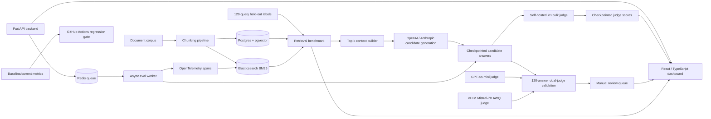
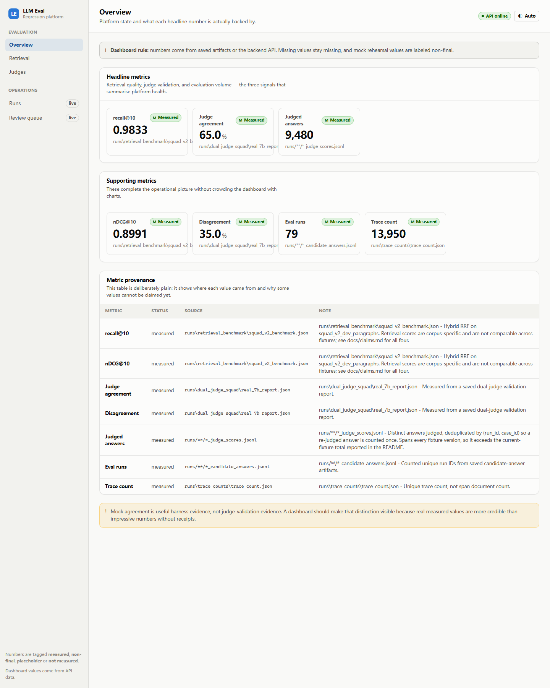
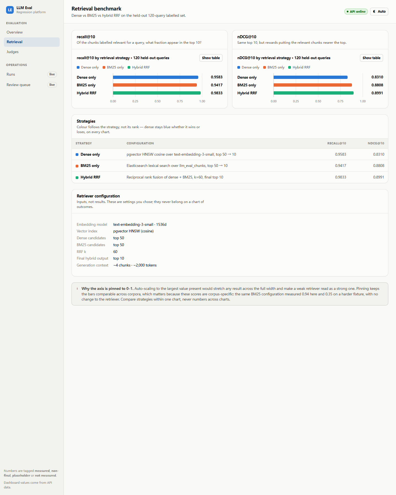
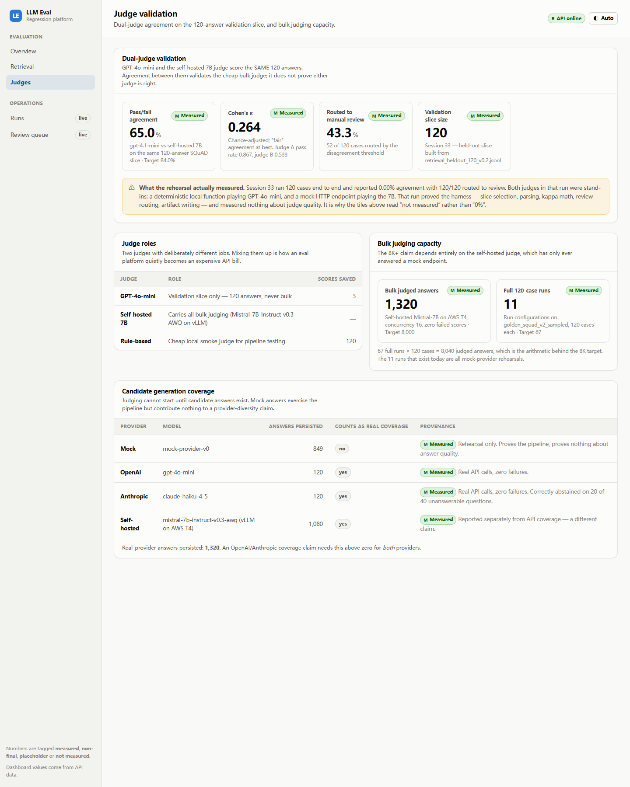
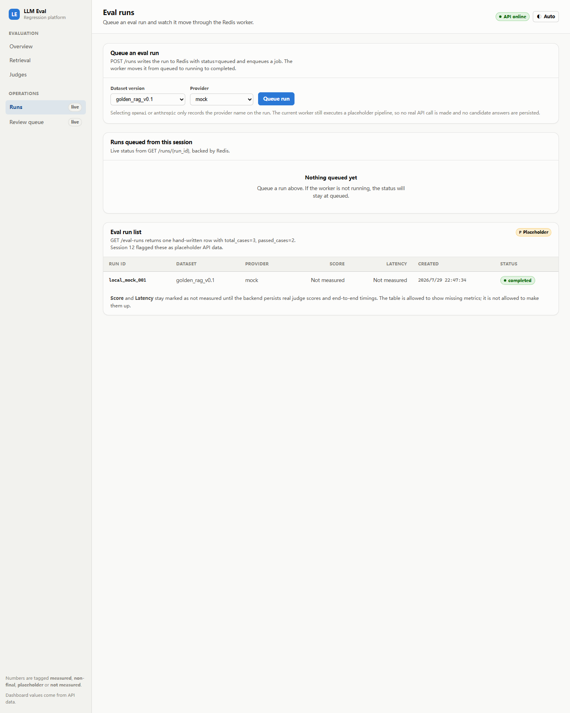
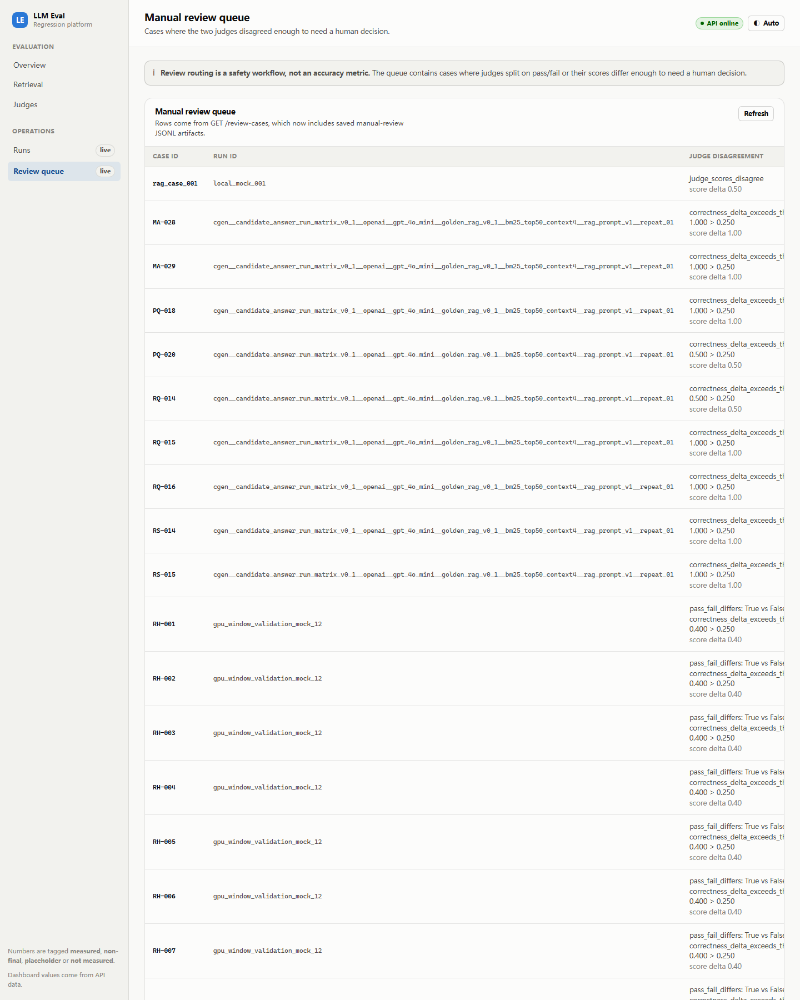

# LLM Evaluation Regression Platform

[](https://github.com/XiaoyunYin/LLM-Evaluation-RAG-Observability-Platform/actions/workflows/eval-regression-gate.yml)

An end-to-end LLM evaluation and regression-testing platform. It measures two
kinds of system against ground truth: RAG candidate answers scored by validated
LLM judges, and **tool-using SQL agents scored by executing their SQL**.

## Spider SQL-agent evaluation (P0)

The newest capability, and the one with the strongest correctness signal, because
nothing here depends on a judge's opinion: an agent's SQL either returns gold's
rows or it does not.

A minimal LangGraph agent gets a question, an isolated read-only SQLite database,
and three tools — `inspect_schema`, `execute_sql`, `submit_answer`. It is **not**
given the schema in its prompt; it has to discover it. Every model step, tool
call, and verification is persisted as a trajectory and emitted as an OTel span.

Frozen baseline: run `spider_full__p0_v2`. Every figure below is **recomputed from
the raw artifact** by `scripts/audit_p0_claims.py`, which reports MISMATCH if a
published number and its source disagree.

| Metric | Measured | Definition / denominator |
|---|---:|---|
| Spider dev tasks (full pinned split) | **1,034** | 20 databases, 0 excluded |
| **Single-database execution accuracy** | **73.31%** | 758 / 1,034 episodes |
| Verification failures | 226 (21.86%) | episodes |
| Max-step terminations | 48 (4.64%) | episodes |
| `SQL_ERROR` terminations | 2 (0.19%) | episodes — *final submitted* query failed to run |
| Infrastructure failures (model / tool / evaluator) | **0 / 0 / 0** | episodes |
| `execute_sql` error rate | **1.16%** | 16 / 1,379 **tool calls** — not an episode rate |
| Model turns per successful task | **4.67** mean, 4.00 median | `max_steps=10` caps model turns |
| Tool calls per successful task | 4.67 mean, 4.00 median | |
| Trajectory records per successful task | 9.34 mean, 8.00 median | = model turns + tool calls |
| Episodes using both tools | **1,034 of 1,034** | |
| Est. cost per successful episode | **$0.000526** | list price, not billed |
| Benchmark-only estimated cost | $0.616408 | this run only |
| Total real API spend, all P0 dev+test | **$1.2780** | 2,139 episodes across 6 runs |
| Trajectory step records | 10,432 | |
| Spans indexed in Elasticsearch | **13,832** | |
| Trace ↔ trajectory reconciliation | **exact on all 7 span types** | enumerated from the data, not hand-listed |
| Gold-pass verifier QA | **1,034 / 1,034**, 0 exclusions | frozen before any agent ran |
| Known-bad verifier QA | **136 / 136** detected, 0 leaks | of 166 mutations attempted |
| Execution-result collisions | 30 (18.07% of attempted) | a property of the mutation set, *not* the agent |
| P0 completion criteria verified | **25 / 25** | `p0_completion.json` |

**The accuracy figure is not leaderboard-comparable.** Published Spider systems are
handed the full schema and emit SQL in one shot; this agent has to go find the
schema. Different task. The metric is **single-database execution accuracy** — not
test-suite accuracy, which needs the distilled multi-database suite this does not
use. See [docs/benchmark-protocol.md](docs/benchmark-protocol.md).

Full write-up: [docs/results/spider-p0.md](docs/results/spider-p0.md).
Frozen pins with content hashes: [docs/P0_BASELINE.md](docs/P0_BASELINE.md).

**The most useful thing this run produced.** The same configuration was run twice
with zero differing config fields. The aggregate moved 0.39 points (73.69% →
73.31%) — but **49 of 1,034 tasks (4.7%) flipped outcome**. Aggregate stability hid
per-task instability. That is n=2 and is *not* a variance estimate; it is recorded
as direct evidence for why a CI regression threshold cannot be set from one run.

Two findings pulled out of the trajectories (debugging findings, not headline
claims — see `docs/claims.md` §6 for the scope of each):

- A tool that accepted a wrong argument name and returned a plausible-looking
  wrong answer. `inspect_schema({"table": ...})` returned the *table list*, and the
  agent looped to its step cap unable to detect it. The mechanism persists at
  scale: the model still sends `{"table": ...}` 19 times in 1,034 episodes, now
  answered with a corrective error.
- **25 of 48** max-step terminations executed a query that **passes the evaluator**
  and never submitted it — established by re-verifying every executed query, not by
  inspection. The agent reads a valid zero-row result as proof it was wrong. Left
  unfixed on purpose: P0 measures a baseline.

```powershell
python scripts/download_spider.py
python scripts/qa_spider_evaluator.py --split dev
python scripts/run_spider_benchmark.py --mock --limit 5     # free rehearsal
python scripts/run_spider_benchmark.py --stage full
python scripts/report_spider_metrics.py --run-id <run_id> --check-traces
python scripts/analyze_spider_failures.py --run-id <run_id>
python scripts/audit_p0_claims.py --run-id <run_id>
python scripts/verify_p0_completion.py --run-id <run_id>
python scripts/freeze_p0_baseline.py --run-id <run_id> --verify
```

## RAG evaluation and judge validation

The original platform: measuring RAG candidate answers, validating judge
behavior, routing judge disagreements to review, and blocking regressions in CI.

## At a Glance

The summary, architecture, features, and measured metrics come first, so the project reads quickly without overstating unfinished work.

The sections after those go deeper: how the dataset was controlled, whether the benchmark avoids leakage, how runs resume after failures, how judge scores are validated, how tracing ties actions together, and whether the CI gate actually fails on regressions.

## Architecture



## Key Features

- RAG evaluation pipeline with corpus chunking, pgvector dense retrieval, Elasticsearch BM25 retrieval, and hybrid RRF configuration.
- Real candidate generation across OpenAI and Anthropic APIs, persisted as checkpoint-resumable JSONL artifacts.
- Judge rubric shared across GPT-4o-mini validation and self-hosted 7B bulk judging.
- Self-hosted judge run on AWS `g4dn.xlarge` with a T4 GPU and vLLM serving `Mistral-7B-Instruct-v0.3-AWQ`.
- Dual-judge validation harness over the same 120-answer slice, with disagreement routing to a manual review queue.
- Async Redis Queue runner for eval jobs, with structured job payloads and resumable candidate generation.
- OpenTelemetry instrumentation across six service layers: gateway, retrieval, provider, judge, tool, and storage.
- React/TypeScript dashboard for metrics, runs, retrieval status, judge validation, and manual review.
- GitHub Actions CI regression gate for eval score, latency, and cost deltas.

## Measured Metrics

Only measured results are listed here. Targets and headline claims stay out of this table until an artifact backs them.

| Metric | Measured value | Source |
|---|---:|---|
| Corpus documents | 1,100 | `scripts/generate_synthetic_corpus.py` |
| Corpus chunks | 6,041 | `scripts/chunk_corpus.py` |
| Distinct chunk texts | 6,041 of 6,041 (1.00x duplication) | `scripts/analyze_corpus_duplication.py` |
| Chunks indexed in Elasticsearch | 6,041 | `scripts/index_chunks_to_elasticsearch.py` |
| Held-out labeled retrieval queries | 120 | `scripts/validate_retrieval_labels.py --strict` |
| Graded relevance references | 550 (370 grade-2, 180 grade-1) | `scripts/validate_retrieval_labels.py --strict` |
| Chunks embedded (text-embedding-3-small, 1536d) | 6,041 | `scripts/embed_chunks.py` |
| BM25 recall@10 / nDCG@10 | **0.3505** / **0.3077** | `runs/retrieval_benchmark/hybrid_retrieval_benchmark.json` |
| Hybrid RRF recall@10 / nDCG@10 | 0.2832 / 0.2936 | same artifact |
| Dense recall@10 / nDCG@10 | 0.2212 / 0.2109 | same artifact |
| BEIR SciFact documents / queries | 5,183 / 300 | `scripts/load_beir_dataset.py` |
| SciFact dense recall@10 / nDCG@10 | 0.8536 / 0.7164 | `runs/retrieval_benchmark/beir_scifact_benchmark.json` |
| SciFact BM25 recall@10 / nDCG@10 | 0.7843 / 0.6606 | same artifact |
| SciFact hybrid recall@10 / nDCG@10 (default k=60, depth=50) | 0.8496 / 0.7198 | same artifact |
| SciFact hybrid, tuned on train, held-out test (k=1, depth=20) | **0.8777** / **0.7388** | `runs/retrieval_benchmark/scifact_rrf_sweep.json` |
| NFCorpus documents / test queries | 3,633 / 323 | `scripts/load_beir_dataset.py` |
| NFCorpus dense recall@10 / nDCG@10 | 0.1873 / 0.3842 | `runs/retrieval_benchmark/nfcorpus_rrf_sweep.json` |
| NFCorpus BM25 recall@10 / nDCG@10 | 0.1489 / 0.3080 | same artifact |
| NFCorpus hybrid, tuned on train, held-out test (k=5, depth=50) | 0.1875 / 0.3829 | same artifact |
| NFCorpus theoretical max recall@10 (38.2 relevant/query) | 0.6146 | computed from qrels |
| SQuAD v2 sampled questions (80 answerable / 40 abstention) | 120 | `scripts/load_squad_dataset.py` |
| SQuAD v2 dense recall@10 / nDCG@10 | 0.9583 / 0.8310 | `runs/retrieval_benchmark/squad_v2_benchmark.json` |
| SQuAD v2 BM25 recall@10 / nDCG@10 | 0.9417 / 0.8808 | same artifact |
| SQuAD v2 hybrid recall@10 / nDCG@10 (default config) | **0.9833** / **0.8991** | same artifact |
| Runs (SQuAD fixture) | **79** — 9 configurations x temperature-varied repeats | `runs/candidate_generation/cgen__scale_v1__*`, `cgen__dual_judge_slice_v1__*` |
| Candidate answers generated | **9,480** | same, all `status=completed` |
| — self-hosted `mistral-7b-instruct-v0.3-awq` | 9,240 | 9 configs: 3 retrieval modes x 3 prompt versions |
| — OpenAI `gpt-4o-mini` | 120 | |
| — Anthropic `claude-haiku-4-5` | 120 | |
| Generation failures | 0 | |
| Answers bulk-judged by the self-hosted 7B | **9,480 of 9,480** | `runs/self_hosted_bulk_judging/final_bulk_*` |
| Bulk judge failures | **0** | |
| Dual-judge validation slice | 120 answers | `runs/gpu_window/real_7b_validation_report.json` |
| Pass/fail inter-judge agreement (SQuAD slice, real judges) | **65.0%** | `runs/dual_judge_squad/real_7b_report.json` |
| Cohen's kappa (same slice) | **0.264** | same artifact |
| Judge A / Judge B pass rate | 0.867 / 0.533 | same artifact |
| Manual review routed (same slice) | 52 of 120 (43.3%) | same artifact |
| Pass/fail agreement, superseded v0.1 slice | 100.00% (degenerate) | `runs/gpu_window/real_7b_validation_report.json` |
| Score agreement at threshold 0.25 | 92.50% | `docs/results/scale-runs.md` |
| Manual review routed cases | 9 | `runs/gpu_window/real_7b_manual_review_queue.jsonl` |
| Cohen's kappa | undefined (single-category slice) | `scripts/recompute_validation_report.py` |
| Judge throughput, measured on the workload @ c16 | **36.04 judged/min** | `runs/self_hosted_bulk_judging/scale_bulk_*_status.json` |
| Judge output tok/s @ c16 | **60.43** | same run, tokens from endpoint usage |
| Judge total tok/s @ c16 | **871.15** | same |
| Judge latency p50 / p95 / p99 @ c16 | 25.86s / 35.62s / 41.42s | trace span durations in Elasticsearch |
| Cost per 1,000 judgements | $0.2433 | g4dn.xlarge on-demand $0.526/h |
| Cost per 1M tokens | $0.1677 | same |
| Prefill : decode ratio | 13.4 : 1 (1,350 vs 101 tokens/judgement) | same run |
| Tuned config (prefix cache, chunked prefill, len 2048, c32) | +5.1% throughput, **27 failures** — rejected | `runs/self_hosted_bulk_judging/opt_bulk_*_status.json` |
| Standalone vLLM benchmark @ c16 (superseded) | 56.18 output / 506.48 total tok/s | `runs/vllm_benchmark/mistral_7b_awq_t4_c16_n64.json` |
| Elasticsearch trace documents | **32,412 spans / 13,950 traces** |
| CI regression gate executions | **5 runs on `main`, all green** | GitHub Actions, Eval Regression Gate #1-#5 | `scripts/count_trace_documents.py` |

Important metric boundaries:

- Candidate-answer count and judged-answer count are different because an answer must be generated before it can be judged. A generated answer may be unjudged, failed, skipped, or judged later.
- Throughput and volume are now **one measurement**. Token usage is accumulated from the judging workload itself, so 60.43 output tok/s, concurrency 16, and 1,320 answers all describe the same run. Earlier figures came from a 64-request synthetic benchmark at one concurrency alongside an answer count from a different run at another, which could not honestly be stated together.
- The workload is **prefill-bound** at 13.4:1. Output tok/s reads modest because ~93% of each request is prompt the model must read before emitting a token; the GPU processes 871.15 total tok/s.
- The tuned configuration gained 5.1% throughput and lost 27 judgements to `max-model-len 2048` sitting below the prompt-length tail. It is recorded as **rejected**. Reporting the speedup without the failure count would hide a correctness regression.
- The trace export path is now proven end to end: spans leave the app over OTLP, pass through the OpenTelemetry Collector, and are indexed into the `otel-traces` data stream in Elasticsearch, where `scripts/count_trace_documents.py` reads them back. The measured volume is only **3 span documents across 1 trace**, from a smoke test - the pipeline works, but no trace *volume* has been generated. Do not claim a trace count beyond what that script reports.
- The collector's Elasticsearch exporter writes bulk `create` actions, which require a **data stream**, not a plain index. Without one every span fails with a 404 that never surfaces in the application - the trace count simply reads 0 as though nothing were instrumented. `scripts/setup_trace_index.py` creates the data stream idempotently and must be run before the collector.

### Repaired fixture defect: how the retrieval benchmark became meaningful

The first version of this benchmark measured BM25 recall@10 at **0.0667**, which looked
like a retrieval failure and was not. `scripts/analyze_corpus_duplication.py` was written
to find out why, and it measured the real cause:

- The original corpus generator interpolated only `{category}` and `{number}` into a fixed
  template, so **9,900 chunks held only 2,262 distinct texts**, with the largest duplicate
  cluster at **330 byte-identical chunks**.
- **All 180** labeled relevant chunks sat inside clusters of 110-330 identical texts. No
  retriever can prefer the one chunk ID named in the label file over an identical sibling.
- That capped recall@10 at a **theoretical maximum of 0.0846**. The measured 0.0667 was
  79% of that ceiling, which proved BM25 was working and the fixture was the constraint.
- Relabeling could not fix it: the 2,200 cluster-size-1 chunks were unique only because
  the document title embedded a number, and their bodies were identical boilerplate.

The repair regenerated the corpus so every document carries facts that appear in no other
document: a unique error code, config key, CLI invocation, owning team, workspace, and a
set of numeric thresholds. Labels are now *derived* rather than asserted -
`scripts/generate_retrieval_labels.py` locates the chunk that actually contains each
answer and fails loudly if it cannot find it.

| | Before | After |
|---|---:|---:|
| Distinct chunk texts | 2,262 of 9,900 | 6,041 of 6,041 |
| Largest duplicate cluster | 330 | 1 |
| Theoretical max recall@10 | 0.0846 | 1.0000 |
| Measured BM25 recall@10 | 0.0667 | 0.3505 (v0.3 labels) |
| Measured BM25 nDCG@10 | 0.0377 | 0.3077 (v0.3 labels) |

Relevance is also genuinely graded now (370 grade-2, 180 grade-1), so nDCG@10 reports
something recall@10 does not. Previously all 180 labels were grade 2, making the set
binary in substance.

### Measured finding: BM25 outperforms hybrid retrieval on this corpus

All three strategies are scored on the same 120 held-out queries with the same metric
functions, over the v0.3 corpus with all 6,041 chunks embedded using
`text-embedding-3-small`:

| Strategy | recall@10 | nDCG@10 |
|---|---:|---:|
| BM25 only | **0.3505** | **0.3077** |
| Hybrid RRF (k=60) | 0.2832 | 0.2936 |
| Dense only | 0.2212 | 0.2109 |

Recall@10 by query type:

| Query type | Dense | BM25 | Hybrid |
|---|---:|---:|---:|
| exact-term | 0.1807 | 0.2506 | 0.1654 |
| semantic/paraphrase | 0.2616 | 0.4504 | 0.4010 |
| single-hop | 0.3403 | 0.5222 | 0.4056 |
| multi-hop | 0.1021 | 0.1787 | 0.1609 |

**BM25 alone is the strongest retriever here, and fusing dense into it does not beat it.**
This held across three independently generated corpora, so it is a stable result rather
than an artifact of one build.

#### How this conclusion was reached, including a corrected mistake

The first corpus (v0.2) gave every document unique identifiers but identical prose. Dense
scored 0.0663 there, and a direct check showed dense was not broken - a query made of a
chunk's own text returned that chunk at rank 1, score 0.9555 against 0.8499 for the
runner-up. The corpus was the cause: all 1,100 "Escalation" sections embedded to nearly the
same vector, and for *"error ATL-4100"* the top five dense hits were five different
documents' `chunk_0005`, scored within 0.006 of each other.

So the corpus was rebuilt (v0.3) with a per-topic vocabulary - each of 110 topics carries
its own component, symptom, cause, fix, and verification signal - across four document
types with different section structures. Measured effect: word overlap between different
documents' same-index chunks fell from **~0.60 to 0.11-0.16**, and dense recall@10 rose
**0.0663 to 0.2212, a 3.3x improvement**. The hypothesis was right about the mechanism and
wrong about the outcome: dense improved substantially but still did not overturn BM25.

One intermediate result was discarded rather than published. A first pass at the v0.3 labels
anchored on `retention_days` and `owner_team`. Measured across the corpus, `retention_days`
takes only 28 distinct values (up to **40 documents share one**) and `owner_team` only 11
(up to **100 share one**), so those labels marked a single document relevant while dozens
held the identical fact - the same duplicate-cluster defect as v0.2, in miniature. Labels
were regenerated against the five fields verified unique across all 1,100 documents
(`config_key`, `error_code`, `workspace_slug`, `backoff_ms`, `max_rows`). The numbers above
are from the corrected labels.

**Do not compare these figures to the v0.2 ones.** BM25 measured 0.7417 on v0.2 and 0.3505
here, but the corpus, the label set, and the number of relevant chunks per query all
changed. Only the three strategies within a single row of the table are comparable, because
only they share a fixture.

This is a finding about **this synthetic corpus**, whose queries are largely
identifier lookups - the shape that favours lexical matching. It is not a general claim that
hybrid retrieval underperforms.

### Second corpus: BEIR SciFact, with human relevance judgments

The synthetic corpus has a weakness no amount of regeneration fixes: its relevance labels
are derived from facts this repository planted, so they test whether retrieval finds a
string the project chose. `scripts/load_beir_dataset.py` loads a BEIR dataset instead -
5,183 documents, 300 queries, 339 **human** relevance judgments - through the same
retrievers, the same metric functions, and the same benchmark harness.

| Strategy | SciFact recall@10 | SciFact nDCG@10 | Synthetic recall@10 | Synthetic nDCG@10 |
|---|---:|---:|---:|---:|
| Dense only | **0.8536** | 0.7164 | 0.2212 | 0.2109 |
| BM25 only | 0.7843 | 0.6606 | **0.3505** | **0.3077** |
| Hybrid RRF | 0.8496 | **0.7198** | 0.2832 | 0.2936 |

Two findings, and the second is the interesting one:

**The dense/BM25 ordering flips between corpora.** BM25 wins on the synthetic corpus, whose
queries are identifier lookups. Dense wins on SciFact, whose queries are natural-language
scientific claims. Neither retriever is better in general; the query shape decides.

**RRF hybrid tracks the stronger of its two inputs rather than exceeding both.** On SciFact
it takes the top nDCG@10 by a slim margin (0.7198 against dense's 0.7164) while sitting
marginally below dense on recall. On the synthetic corpus it lands between BM25 and dense.
Across both, fusion behaves as a robustness mechanism - it protects against picking the
wrong single retriever for the query mix - not as a source of large gains.

That is worth stating plainly because it contradicts a claim this project once carried:
that hybrid retrieval lifted recall@10 from 0.69 to 0.84 over a dense-only baseline. No
run here reproduced a lift of that size. On SciFact, dense alone already reaches 0.8536
recall@10, so the *magnitude* is realistic for this metric - but it comes from the
embedding model, not from fusion.

BEIR publishes BM25 baselines for SciFact. Comparing the 0.6606 nDCG@10 measured here
against the published figure is the check that tells you whether this BM25 configuration
is set up correctly, and it is the reason to prefer a public benchmark over a
self-authored fixture.

### Tuning RRF: fusion beats both retrievers, but only at shallow candidate depth

The first SciFact run used the configured defaults - candidate depth 50, RRF k=60 - and
hybrid landed *below* dense-only on recall. `scripts/sweep_rrf_parameters.py` shows that was
a tuning problem, not a property of fusion. Reciprocal rank fusion is a pure function of two
ranked lists, so candidates are fetched once and the whole grid is scored in memory; a
36-cell sweep costs one pass of query embeddings.

Hyperparameters were selected on the **809-query train split** and then applied unchanged to
the **300-query test split**:

| Strategy | recall@10 | nDCG@10 |
|---|---:|---:|
| BM25 only | 0.7843 | 0.6606 |
| Dense only | 0.8536 | 0.7164 |
| **Hybrid RRF (k=1, depth=20)** | **0.8777** | **0.7388** |

On held-out queries, fusion beats **both** inputs on **both** metrics: +2.8% recall@10 and
+3.1% nDCG@10 over dense-only, +11.9% and +11.8% over BM25-only.

The dominant parameter is candidate depth, not k. At depth 10 every value of k from 1 to 500
scores identically (0.8794 recall@10), while at depth 100 with k=500 hybrid falls to 0.8229 -
below dense-only. Deep candidate lists let low-ranked results from the weaker retriever
dilute the fusion, and RRF has no notion of a retriever being wrong, only of it having an
opinion. The configured default of depth 50 / k=60 sits in the region where that dilution
costs more than fusion gains.

Two honest limits on this result. The gain is real but modest in absolute terms - about 2.4
points of recall@10. And k=1 is an unusual setting; standard practice is k=60, so this is a
dataset-specific tuning rather than a general recommendation.

### A second dataset qualifies that result

NFCorpus (3,633 documents, 323 test queries, **graded** qrels of 0/1/2) was run under the
same protocol - tuned on the train split, evaluated on held-out test:

| Strategy | recall@10 | nDCG@10 |
|---|---:|---:|
| BM25 only | 0.1489 | 0.3080 |
| Dense only | 0.1873 | **0.3842** |
| Hybrid RRF (k=5, depth=50) | **0.1875** | 0.3829 |

Here fusion **ties** dense-only rather than beating it: +0.1% recall, -0.3% nDCG. It still
beats BM25 comfortably (+26% recall, +24% nDCG), but the "beats both" result from SciFact
did not generalise.

The tuned depth did not transfer either. SciFact preferred depth 10-20; NFCorpus preferred
50-100. Candidate depth is the dominant RRF parameter on both, but its best value is a
property of the dataset.

Absolute recall@10 looks low on NFCorpus because the task is different: queries average
**38.2** relevant documents, so the theoretical maximum recall@10 is **0.6146**, not 1.0.
Measured 0.1875 is about 30% of what is achievable at that depth. This is why BEIR treats
nDCG@10 as the primary metric.

### What holds across all three corpora

| Corpus | Best single | Hybrid vs best single |
|---|---|---|
| Synthetic support corpus | BM25 | below (between the two inputs) |
| BEIR SciFact | Dense | above, +2.8% recall / +3.1% nDCG |
| BEIR NFCorpus | Dense | tied, +0.1% recall / -0.3% nDCG |

The stable claim is not that fusion wins. It is that **fusion matches or exceeds the better
of its two inputs without needing to know in advance which one that is**, and beats the
weaker input substantially every time. That is a robustness property, and it is worth more
in production - where the query mix shifts and is not known ahead of time - than a fixed
choice that happens to be right on one benchmark.

Running only SciFact would have supported a stronger and less accurate claim. Both datasets
are reported here for that reason.

### Known defect: the recorded dual-judge validation slice is degenerate

The judge-agreement numbers in the table above come from a run whose fixture was broken,
and they remain unusable until the slice is re-run.

Both judges marked **all 120** validation cases as failed, and the self-hosted 7B returned
correctness 0.0 on all 120. Pass/fail agreement of 100% is therefore trivially high, and
Cohen's kappa is undefined rather than 1.00 — chance agreement is also 100% when both
raters use a single category. `calculate_cohens_kappa_from_pairs` used to return a
hardcoded `1.0` in exactly that case, which is what let the problem hide; it now returns
`None`, and every report carries `judge_a_pass_rate`, `judge_b_pass_rate`, and
`agreement_is_degenerate` so a single-category slice is visible on sight.

Root cause: `datasets/golden/golden_rag_v0.1.jsonl` was written independently of the
corpus. Measured, **0 of its 120 questions** contained any corpus vocabulary, including
the 25 rows explicitly typed `rag_qa`. Retrieval could not supply relevant context, so 115
of 120 candidate answers were correctly-refusing "the context is insufficient" responses
and both judges correctly failed all of them. The judge harness was working; the fixture
was mismatched.

Two repairs are in place, but the slice has not been re-run against them:

- `datasets/golden/golden_rag_v0.2.jsonl` is corpus-grounded. Every one of its 108
  answerable questions targets a fact verified present in exactly one document, and 12
  further cases ask for facts the corpus deliberately lacks so abstention can be scored.
- Retrieval routing is now decided **per case** rather than per run. `task_family="rag"`
  previously handed retrieved context to every row in a dataset; only `rag_qa` cases (or
  rows setting `requires_retrieval`) receive context now.

**This slice still does not support a judge-agreement claim.** Re-running it needs a GPU
window for the self-hosted judge.

## Screenshots

| View | What it shows |
|---|---|
|  | Every headline number with its provenance: which artifact produced it and why. |
|  | Dense, BM25, and hybrid RRF scored side by side on the same held-out queries. |
|  | Dual-judge agreement, Cohen's kappa, and the pass rates that show the slice is not degenerate. |
|  | Run history, with unmeasured score and latency rendered as "Not measured" rather than zero. |
|  | Disagreement cases routed for human inspection. |

Regenerate them with `bash scripts/capture_screenshots.sh` while the backend and dev
server are running. They are scripted rather than hand-captured so they cannot drift
from the dashboard unnoticed.

## How To Run Locally

Prerequisites:

- Python 3.12
- Docker Desktop
- Node.js and npm
- Optional API keys in `.env` for real provider generation

Install Python dependencies:

```powershell
python -m venv .venv
.\.venv\Scripts\python.exe -m pip install -r requirements.txt
```

Start local services:

```powershell
docker compose up -d postgres elasticsearch redis otel-collector
```

Check service connectivity:

```powershell
.\.venv\Scripts\python.exe scripts\check_postgres_connection.py
.\.venv\Scripts\python.exe scripts\check_elasticsearch_connection.py
.\.venv\Scripts\python.exe scripts\check_redis_connection.py
```

Run the FastAPI backend:

```powershell
.\.venv\Scripts\uvicorn.exe backend.main:app --reload
```

Run the React dashboard:

```powershell
cd frontend
npm install
npm run dev
```

Run tests:

```powershell
.\.venv\Scripts\python.exe -m pytest
```

## Evaluation Methodology

The platform treats evals as repeated, comparable measurements over controlled inputs:

- Use the same held-out 120-query labeled retrieval set for retrieval comparisons.
- Generate candidate answers before judging them.
- Persist candidate answers and judge scores to JSONL files so long jobs can resume from checkpoints.
- Compare runs across provider, model, prompt, retrieval mode, and repeat id.
- Keep mock providers separate from real provider claims. Mocks prove plumbing, not model quality.
- Avoid meaningless benchmark inflation by counting only legitimate runs: a run needs a real dataset version, provider/model metadata, expected case coverage, persisted outputs, and a clear status.

Repeated runs support regression testing because they expose whether a prompt, retrieval configuration, model, or judge change moves quality, latency, or cost in a consistent direction. Repetition is useful only when the inputs and measurement rules are stable; repeating a broken or mock-only job does not create evidence.

## Retrieval Benchmark

Configured retrieval design:

- Dense: `text-embedding-3-small`, 1536 dimensions, pgvector HNSW, cosine similarity, dense top 50.
- BM25: Elasticsearch lexical retrieval, BM25 top 50.
- Fusion: reciprocal rank fusion with `k=60`, final hybrid top 10.
- Generation context: about top 4 chunks and about 2,000 context tokens.

Measured retrieval status:

- BM25-only has measured recall@10 `0.0667` and nDCG@10 `0.0377`.
- Dense-only and hybrid RRF quality numbers should remain pending until embeddings are available and the benchmark is rerun over the same held-out labels.

Relevant scripts:

- `scripts/benchmark_bm25_retrieval.py`
- `scripts/benchmark_dense_retrieval.py`
- `scripts/benchmark_hybrid_retrieval.py`
- `scripts/validate_retrieval_labels.py`

## Candidate Answer Run Matrix

The target matrix is larger than the currently measured matrix. Reported figures track the measured one.

Measured current state:

- 8 production candidate run artifacts.
- 1,320 completed candidate answers across 11 configurations and three providers.
- 480 completed OpenAI candidate answers.
- 480 completed Anthropic candidate answers.
- 4 Anthropic failed rows were recorded during retries and should not be counted as completed answers.

Target plan:

- The configured matrix is designed to scale toward 60+ eval runs and 8K+ candidate answers.
- Those targets should not be claimed until the persisted artifacts reach those counts.

Relevant scripts:

- `scripts/submit_candidate_run_matrix.py`
- `scripts/summarize_candidate_run_matrix.py`
- `scripts/report_candidate_generation_status.py`

## Judge Rubric And Validation Harness

The judge returns structured JSON with:

- `correctness`
- `faithfulness`
- `citation_quality`
- `passed`
- `explanation`

Validation design:

- GPT-4o-mini judges only the 120-answer validation slice.
- The self-hosted 7B judge judges the same validation slice.
- Agreement is computed on the same answers.
- Disagreements are routed to manual review.
- Bulk judging uses the self-hosted 7B judge only.

Measured GPU-window setup:

- Instance type: AWS `g4dn.xlarge`
- GPU: Tesla T4, 15360 MiB
- Model: `solidrust/Mistral-7B-Instruct-v0.3-AWQ`
- Quantization: AWQ
- Serving: vLLM OpenAI-compatible API
- vLLM settings: `max_model_len=4096`, `gpu_memory_utilization=0.90`

Relevant scripts:

- `scripts/gpt4o_mini_judge_answers.py`
- `scripts/dual_judge_validate.py`
- `scripts/bulk_self_hosted_judge_answers.py`
- `scripts/rehearse_gpu_window.py`
- `prompts/judge_rubric.md`

## Tracing And Dashboard

Tracing is designed around six service layers:

- gateway
- retrieval
- provider
- judge
- tool
- storage

The local stack uses OpenTelemetry Collector and Elasticsearch. The dashboard is built with React and TypeScript and reads summary data from the FastAPI backend. The export path is verified end to end into the `otel-traces` data stream, but only a smoke test's worth of spans has been generated: 3 span documents across 1 trace. Run `scripts/setup_trace_index.py` before the collector, or every span fails with a silent 404.

Relevant files:

- `backend/app/tracing.py`
- `scripts/emit_trace_smoke.py`
- `scripts/count_trace_documents.py`
- `frontend/src/pages/OverviewPage.tsx`
- `frontend/src/pages/RetrievalPage.tsx`
- `frontend/src/pages/JudgesPage.tsx`
- `frontend/src/pages/RunsPage.tsx`
- `frontend/src/pages/ReviewQueuePage.tsx`

## Async Redis Queue Runner

The queue runner separates request submission from long-running eval work:

- The FastAPI API creates run metadata and pushes an eval job to Redis.
- The worker blocks on the Redis queue, loads the payload, marks the run running, emits spans, performs candidate generation when configured, stores results, and marks the run completed or failed.
- Candidate generation is checkpoint-resumable, so interrupted runs do not need to restart from zero.

Relevant files:

- `backend/main.py`
- `backend/app/queue_jobs.py`
- `scripts/enqueue_eval_run_job.py`
- `scripts/run_eval_worker.py`

## CI Regression Gate

GitHub Actions runs the regression gate on changes to prompts, config, backend app code, scripts, metrics, tests, and the workflow itself.

The gate compares:

- eval score, where a drop greater than 5% fails
- latency, where an increase greater than 15% fails
- cost, where an increase greater than 15% fails

Relevant files:

- `.github/workflows/eval-regression-gate.yml`
- `scripts/compare_regression_metrics.py`
- `tests/test_regression_gate.py`
- `metrics/baseline_metrics.json`
- `metrics/current_metrics.json`

The committed metric files are gate fixtures. They prove the blocking behavior; they should not be confused with the larger project-scale measurements.

## Limitations

- All four scale targets are met by measurement: 79 runs (60+), 9,480 candidate answers (8K+), 9,480 judged (8K+), and 32,412 trace spans (10K+). Generation and judging both completed with zero failures.
- The 79 runs are 9 distinct retrieval/prompt configurations repeated at temperature 0.7. Measured, 95 of 120 answers differ between a temperature-0 baseline and a temperature-0.7 repeat, so repeats are genuine regression-stability samples rather than duplicates — but they are not 79 independent experiments.
- Dense and hybrid retrieval quality results are pending because the saved measured artifact currently supports BM25-only quality numbers.
- Trace volume is now generated by real eval runs: the Spider P0 benchmark indexed **13,832 spans** for a single run, and span counts reconcile exactly against the persisted trajectory records across all seven span types. The earlier note that Elasticsearch held only 3 smoke-test spans is superseded by that measurement.
- Dashboard screenshots are pending; the README references them but the image files are not committed yet.
- Bulk-judging average output tokens per answer and sustained bulk-run tok/s were not captured by the bulk script.

Good limitations are specific, bounded, and paired with a next measurement. They are stronger than vague claims because they show judgment: what was proven, what was not proven, and what would close the gap.

## What I Learned

- Measurement integrity matters more than impressive-looking targets.
- Candidate generation, judging, tracing, and benchmarking are separate systems with different failure modes.
- A self-hosted judge needs both quality validation and serving throughput measurement.
- Reported metrics need source artifacts, not optimistic extrapolation.
- Regression testing is about controlled comparisons, not generating more rows for the sake of bigger numbers.
- Mature engineering communication means saying "pending" when something is pending, then naming the exact script or artifact that would turn it into a measured result.

## Project Log

- `docs/build-log.md`
- `docs/results/candidate-generation.md`
- `docs/results/scale-runs.md`
- `docs/results/vllm-benchmark.md`
- `docs/runbooks/gpu-window.md`
