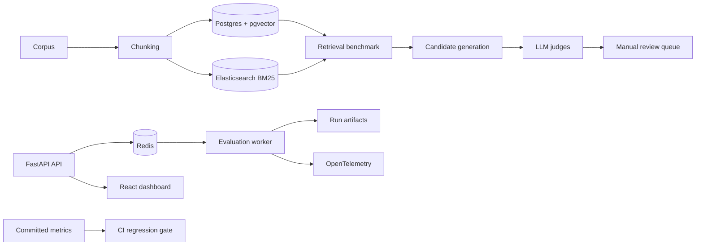
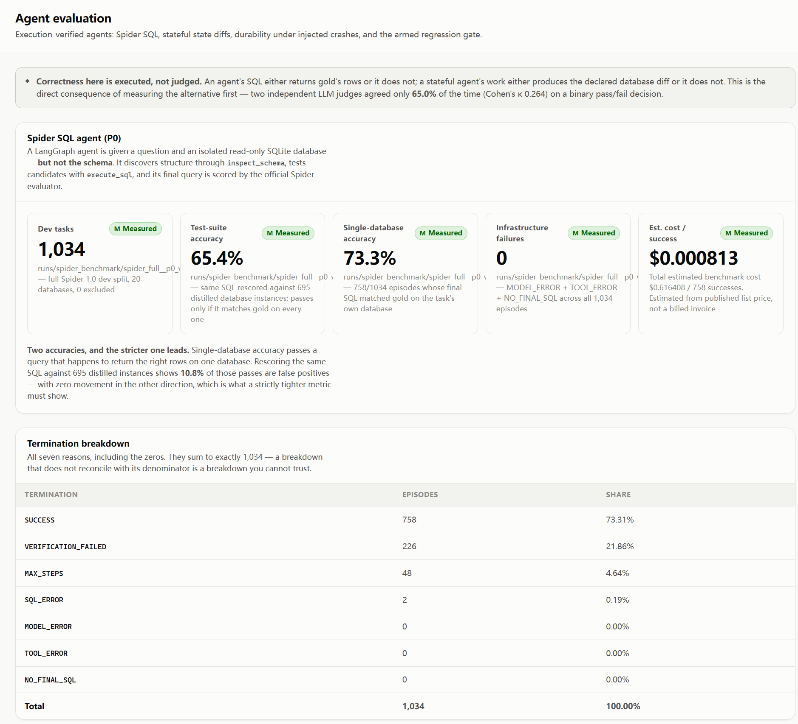
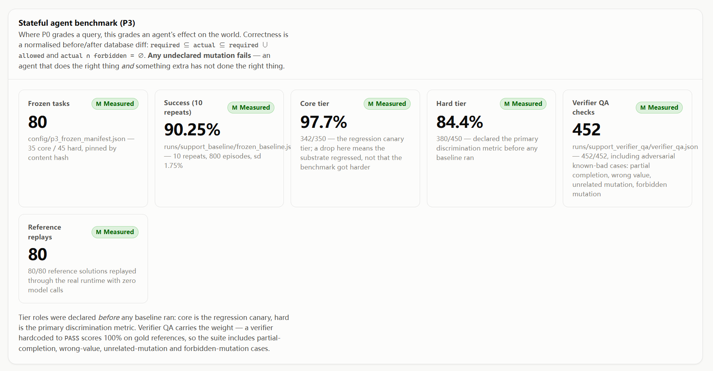
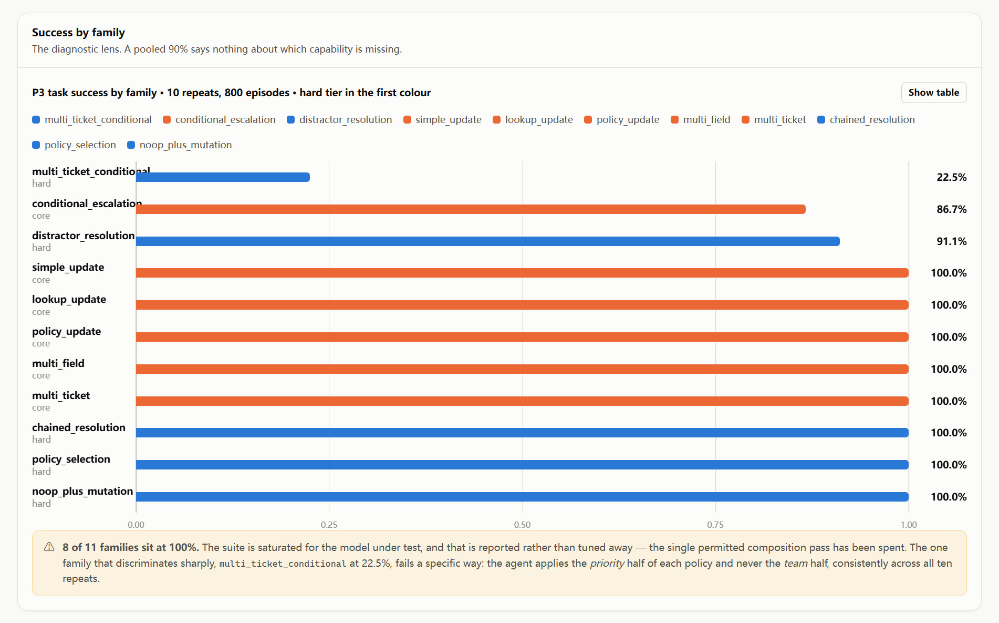
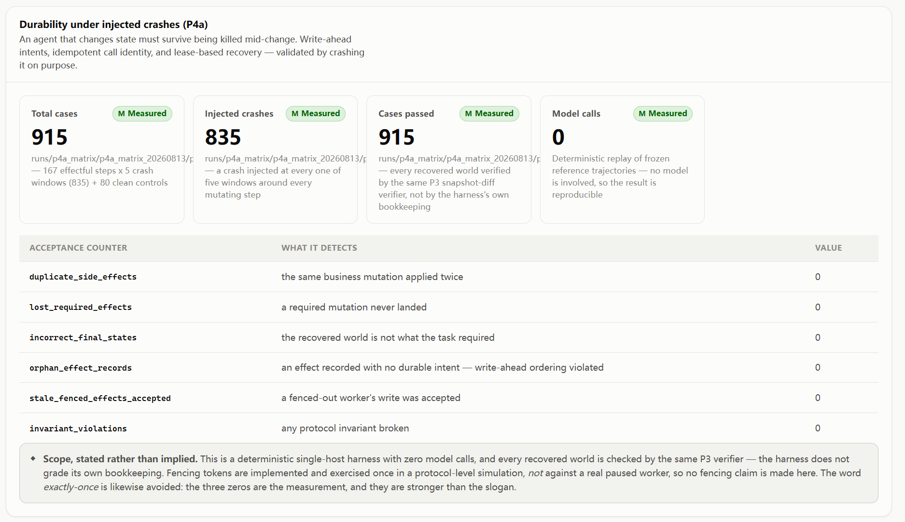

# LLM Agent Evaluation and Reliability Platform

An evaluation platform for tool-using LLM agents. It combines external
correctness checks, reproducible benchmark protocols, run-level provenance, and
an armed regression gate instead of treating an LLM judge as the source of
truth.

The public repository contains the application, tests, compact fixtures, final
reports, and the scripts needed to reproduce the measurements. Raw run output,
generated corpora, and downloaded benchmark collections stay local and are
ignored by Git.

## What it demonstrates

- SQL-agent evaluation against execution and database-state outcomes.
- Stateful support-ticket tasks with required, allowed, and forbidden changes.
- Crash-recovery testing with durable write-ahead intent and idempotent effects.
- Dense, BM25, and hybrid retrieval with candidate generation and judge review.
- A CI regression gate whose thresholds come from measured repeat variance.
- A FastAPI service and React dashboard for evaluation runs, traces, and review.

## Measured results

| Area | Result | Report |
|---|---|---|
| Spider SQL agent | 65.38% test-suite accuracy and 73.31% single-database accuracy on 1,034 dev tasks | [P0 report](docs/results/spider-p0.md) |
| Repeat variance | 1.35 percentage-point maximum spread across four same-commit repeats | [P1 report](docs/results/p1-frozen.md) |
| Targeted SQL-agent change | Frozen-cohort completion increased from 19.23% to 71.79% | [P2 report](docs/results/p2-frozen.md) |
| Stateful support agent | 90.25% mean success across 10 repeats and 800 episodes | [P3 report](docs/results/p3-frozen.md) |
| Crash recovery | 915/915 deterministic cases passed, including 835 injected crashes | [P4a report](docs/results/p4a-matrix.md) |
| Retrieval and judging | Results are scoped by corpus, retriever, candidate depth, and judge agreement | [Claims ledger](docs/claims.md) |

These are separate workloads and should not be combined into one quality score.
The reports document the exact scope and limitations of each result.

## Architecture



## Repository layout

| Path | Purpose |
|---|---|
| `backend/` | FastAPI API, agents, tools, verifiers, tracing, and persistence |
| `frontend/` | React and TypeScript dashboard |
| `config/` | Versioned experiment manifests and provider configuration |
| `datasets/` | Small fixtures; larger corpora are generated or downloaded locally |
| `docs/` | Protocols, evidence boundaries, and final result reports |
| `metrics/` | Committed baseline/current values and gate policy |
| `prompts/` | Versioned agent and judge prompts |
| `scripts/` | Benchmark runners, data preparation, audits, and reports |
| `tests/` | Unit, integration, benchmark, and gate behavior tests |

## Local setup

Prerequisites: Python 3.12, Docker Desktop, Node.js, and provider keys only
when running paid model evaluations.

```powershell
python -m venv .venv
.\.venv\Scripts\python.exe -m pip install -r requirements.txt
docker compose up -d postgres elasticsearch redis otel-collector
.\.venv\Scripts\python.exe -m pytest tests -p no:cacheprovider
```

Start the API and dashboard separately when needed:

```powershell
.\.venv\Scripts\python.exe -m uvicorn backend.main:app --reload
cd frontend
npm install
npm run dev
```

To regenerate local synthetic retrieval data, use
`scripts/generate_synthetic_corpus.py`. BEIR and Spider inputs are downloaded
through the scripts in `scripts/`; their checksums and evaluation rules are
documented in `docs/benchmark-protocol.md` and `docs/LOCKED_INPUTS.md`.

## Reproduce the main SQL-agent baseline

The mock run exercises the runner without making provider requests. A full run
requires the configured provider key and downloads the Spider source data.

```powershell
python scripts/download_spider.py
python scripts/qa_spider_evaluator.py --split dev
python scripts/run_spider_benchmark.py --mock --limit 5
python scripts/run_spider_benchmark.py --stage full
python scripts/report_spider_metrics.py --run-id <run_id> --check-traces
python scripts/audit_p0_claims.py --run-id <run_id>
```

## Evidence model

The project separates four records:

- Protocols define inputs, metrics, exclusions, and decision rules.
- Small fixtures make unit tests and local demos self-contained.
- Run artifacts are generated locally and are not committed to the public tree.
- Reports and audit scripts expose the measured result and its scope.

The [claims ledger](docs/claims.md) maps headline statements to evidence. The
[benchmark protocol](docs/benchmark-protocol.md) explains dataset boundaries,
evaluation definitions, and reproducibility requirements.

## Dashboard screenshots







## Known limits

- Spider accuracy is an internal tool-using-agent baseline, not a leaderboard score.
- The support benchmark is small and partly saturated for the tested model.
- P4a is a deterministic single-host harness; distributed stale-worker fencing is
  not implemented.
- Judge agreement measures consistency between judges, not correctness against a
  human-labeled standard.
- Repeated RAG runs are useful for stability checks but are not independent trials.

## Key documentation

- [Benchmark protocol](docs/benchmark-protocol.md)
- [Claims and evidence](docs/claims.md)
- [Locked Spider inputs](docs/LOCKED_INPUTS.md)
- [P0 results](docs/results/spider-p0.md)
- [P1 results](docs/results/p1-frozen.md)
- [P2 results](docs/results/p2-frozen.md)
- [P3 results](docs/results/p3-frozen.md)
- [P4a results](docs/results/p4a-matrix.md)
- [VLLM benchmark](docs/results/vllm-benchmark.md)
